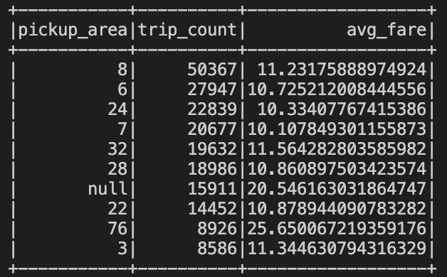

# Chicago trips dataset

Please refer to "Capstone Project.ipynb" for a detailed description.

#### Test query 1
Which community areas has seen the most trips in 2020? What was the average fare for these areas?

#### Test query 2
How much did a trip cost on average, separated by the weather condition present?

#### Test query 3
Display fare, pickup area and the demographics proportion for this area for each trip!

